<!--
  GitHub Profile README — Amine Boussaid
  Inspired by the section-based layout of DenverCoder1,
  customized with a neon terminal / YAML identity.
-->

 

  

---

<h2>🛠️ My Favorite Tools</h2>

<h3>🧑‍💻 Programming and Markup Languages</h3>

  
  
  
  
  
  
  

<h3>🧰 Frontend, Mobile, Frameworks and Libraries</h3>

  
  
  
  
  
  
  
  
  
  
  

<h3>🗄️ Databases and Data Stores</h3>

  
  
  
  
  
  

<h3>☁️ DevOps, Infrastructure and Messaging</h3>

  
  
  
  
  
  
  

---

<h2>🔥 Streak Stats</h2>

  

<h2>💻 GitHub Profile Stats</h2>

  
  

 

> **Note:** Top Languages indique les langages détectés dans mes dépôts publics.
> Cette carte ne représente pas l'ensemble de mon expérience ou de mon niveau.

<h2>⚡ Recent GitHub Activity</h2>

<!--START_SECTION:activity-->
<!--END_SECTION:activity-->

---

## 🐍 Contribution Snake

<picture>
  <source
    media="(prefers-color-scheme: dark)"
    srcset="https://raw.githubusercontent.com/AmineBoussaid/AmineBoussaid/output/github-contribution-grid-snake-dark.svg"
  />
  <source
    media="(prefers-color-scheme: light)"
    srcset="https://raw.githubusercontent.com/AmineBoussaid/AmineBoussaid/output/github-contribution-grid-snake.svg"
  />
  
</picture>

